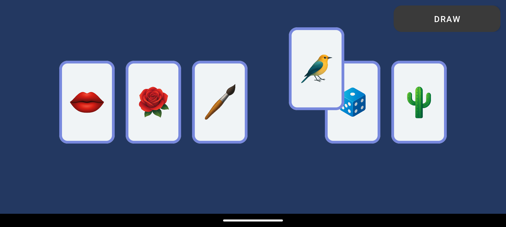

# android-just-imagine
## What is this game
This game was created by Sebastian Kwaśniak.  
Github: https://github.com/SebastianK1999  
   
All images were created using Artificial Intelligence "Microsoft 365 Copilot". Prompt used to generate all images style was "vector graphic, clean, no outline".

## How to play
To play this game you need a group of your friends. Each player draws random cards on the screen and arranges them in the order that fits their story. Player tells everyone a made-up story inspired by the things that the cards remind of. Don't limit your imagination by literal representations on the cards. 
Each next player continues the story of the previous.

